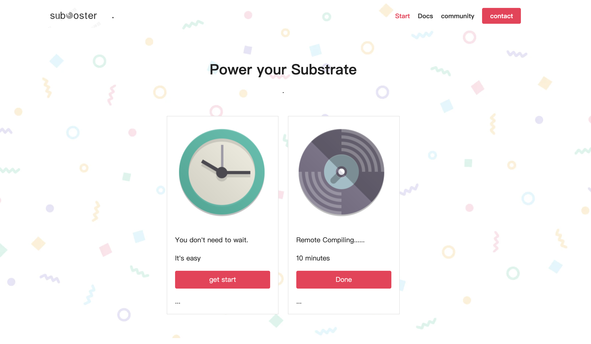

# Treasury proposal: SubBooster,a remote compiling tool for Substrate developers.

Here we are introducing a remote compiling speed up tool which is named `SubBooster` to our community. By engaging a remote service,it helps developers to compile their project in a more efficient way. We've made a pratical MVP for several developers to test, and we are thrilled to invite more people to [test and use it~](https://github.com/sub-box/sub-box)

## Why we make it?

When we develop on the substrate, there are some things alwalys make us mad, ruin our day included:

* Unacceptable compiling time;
* Weak IDE support;
* No binary smart contract sandbox;
* Complex deployment process, etc.

We have been trying to improve above situations for our own sake, like using remote machine to speed up the compiling. Afterwards, we think it would also be useful for others.So we got the idea to make a `SubBox` which aims to make the development on Substrate more efficiency and friendly.

And ,As you know `SubBooster` is the first module of our project

<!-- With the of development of Polkadot and KUSAMA ,more and more peole are involved into the substrate ecosystem.Including developers who making their project on substrate and students or blockchain fans doing experiments on it.while the substrate framwork require a crucial compute source far beyond common users device.It usually takes hours to do the compile stuff.It's neither easy nor efficiency to compile the project for users,which keep many people out of this brand new field. -->

## How it works

The current MVP is implemented in following steps,

1. user provides name and SSH public key to admin;
2. admin creates specific user account and authorizes this key in compiling server;
3. user isntalls [cargo remote](https://github.com/sgeisler/cargo-remote) and configure it to use above compiling server.
4. user compiles projects using `cargo remote` and tests the binary by logining the compiling server.

As you can see, most of the above actions are operated manually. We are going to implement following features in this proposal,

1. user registers a web app by using a Kusama/Polkadot address with onchain identity configured;
2. user configures the SSH public key and sign a specific message like `Substrate Box` by using the account corresponding above address (polkadot js browser extension needed);
3. backend service creates user caccount using onchain name and authorizes above SSH public key in compiling service;
4. further steps is same in above MVP.

The cancellation of register will happen in scenarios,
* user requests cancellation;
* onchain identity is removed;
* user uses the service aginst the rules.

## How to benefit our community?

<!-- We make good toointend to bring these values to the ecosystem: -->

* We made useful tools to helop attract more Rust developers to Substrate development.
* We help to save non-renewale time for Substrate developers and boost their project.
* We will create more use cases for well designed feathers such as onchain identify/vote to leverage the value of our network

## Technical roadmap

### Milestone 1: backend service automation.

Period: 1 month.

After this milestone, early users should be able to submit a form with user and public key information and enjoy the compiling service within 10 mins, without operation of human.

Tasks:

* scripts to deploy and manage the comiling server;
* a web service can save the information provided by the user;
* a scheduled task to register new user in compiling server;
* detail documentation on how to use this compiling service.

### Milestone 2: onchain integration.

Period: 1.5 month.

After this milestone, users can register the web app with Kusama/Polkadot account and sign a message to prove that they are eligible to use the compiling service.

Tasks:

* Kusama/Polkadot onchain identity integration;
* Intergrate polkadot js extension to sign message;
* Backend service verify the message and apply user to comiling server.

### Milestone 3: user onboarding

After this milestone, users should be able to apply free compiling service based on their onchain identity. We also plan to help students who don't have money to register onchain identity.

we will get reach to the users from the rust community, Polkadot community, KUSAMA community,and provide guidance docs and online communication through Discord, Telegram, Wechat,etc to insure more people make best use of this tool.

Period: 1.5 months.

Tasks:

* benchmark how many users can be supported in single server;
* scripts to scale up compiling servers;
* add promote code logic for students and new comers;
* implement cancellation of service based on the above mentioned rules;
* consulting 3rd party to finalize terms of service.
* User community maintaince

## Budget

According the task in the technical map,here is a budget based on the tasks and sources.

<!-- ### Server configuration
- renting servers :10 severs well meet the requirements
|Amd |3950x| CPU
16core| 32threads
250G SSD |64G Memory
|bandwith:|xxxT
customized IP
<!-- -->
<!-- - Deployment Optmize and maintaince
We will make a series of automatic scripts to fit the compiling workflow.
Monitor the severs,optimize the sever performance,disaster backup to provide stable and convinient service.

<!-- A web-based interface will be provided for users to register and get access to the tool. --> 
<!--  -->

## Team introduction

[Kevin](https://github.com/gbt1988)     :no4long@gmail.com

[Popeye](https://github.com/popeye-rs)  :popeye-rs@163.com

## Join for early test

Please read this [guide](https://github.com/sub-box/sub-box) and apply a test account by [post an issue](https://github.com/sub-box/sub-box/issues) here.

<!-- ## More about Subbox -->
